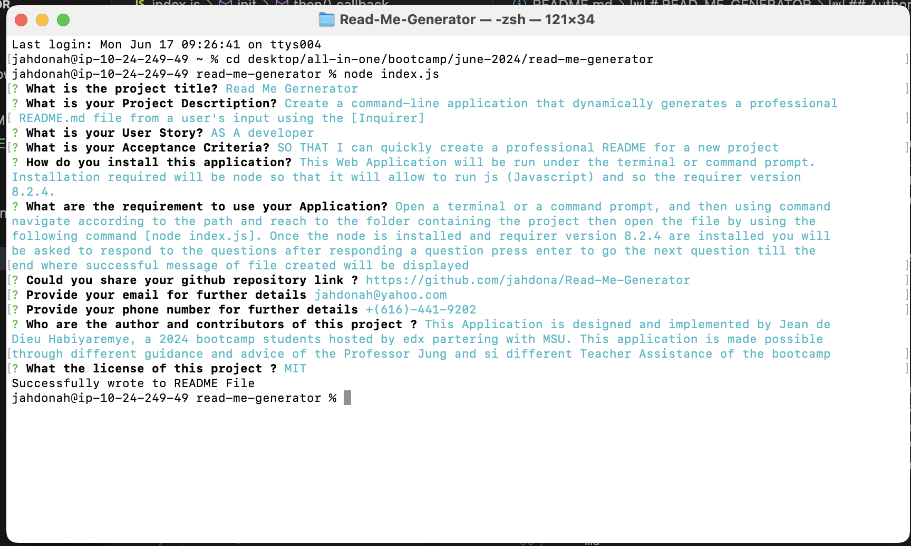
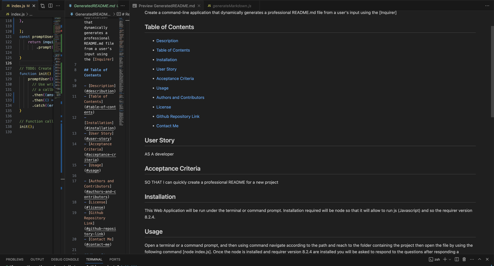

# READ-ME-GENERATOR

## Description
```md
Create a command-line application that dynamically generates a professional README.md file from a user's input using the [Inquirer]
```
## Table of Contents

- [Description](#describution)
- [Table of Contents](#table-of-contents)
- [Installation](#installation)
- [User Story](#user-story)
- [Acceptance Criteria](#acceptance-criteria)
- [Usage](#usage)

- [Authors and Contributors](#authors-and-contributors)
- [License](#license)
- [Test](#test)
- [Github Repository Link](#github-repository-link)
- [Google Drive Link Hosting the video](#google-drive-link-hosting-the-video)
- [Contact Me](#contact-me)

## Installation
```md
This Web Application will be run under the terminal or command prompt. Installation required will be node so that it will allow to run js (Javascript) and so the requirer version 8.2.4. 

```
## User Story

```md
AS A developer
I WANT a README generator
SO THAT I can quickly create a professional README for a new project
```

## Acceptance Criteria

* GIVEN a command-line application that accepts user input
* WHEN I am prompted for information about my application repository
* THEN a high-quality, professional README.md is generated with the title of my project and sections entitled Description, Table of Contents, Installation, Usage, License, Contributing, Tests, and Questions
* WHEN I enter my project title
* THEN this is displayed as the title of the README
* WHEN I enter a description, installation instructions, usage information, contribution guidelines, and test instructions
* THEN this information is added to the sections of the README entitled Description, Installation, Usage, Contributing, and Tests
* WHEN I choose a license for my application from a list of options
* THEN a badge for that license is added near the top of the README and a notice is added to the section of the README entitled License that explains which license the application is covered under
* WHEN I enter my GitHub username
* THEN this is added to the section of the README entitled Questions, with a link to my GitHub profile
* WHEN I enter my email address
* THEN this is added to the section of the README entitled Questions, with instructions on how to reach me with additional questions
* WHEN I click on the links in the Table of Contents
* THEN I am taken to the corresponding section of the README

## Usage

```md
Open a terminal or a command prompt, and then using command navigate according to the path and reach to the folder containing the project then open the file by using the following command [node index.js]. Once the node is installed and requirer version 8.2.4 are installed you will be asked to respond to the questions after responding a question press enter to go the next question till the end where successful message of file created will be displayed

```
## Mock Up

The following images show the web application's appearance and functionality:

* The image below shows the terminal and answers provided from different questions and so the successful message of the file creation

    

* The image below shows the README FILE CREATED OUT OF THE ANSWER PROVIDED
    
## Authors and Contributors

```md
This Application is designed and implemented by Jean de Dieu Habiyaremye, a 2024 bootcamp students hosted by edx partering with MSU. This application is made possible through different guidance and advice of the Professor Jung and si different Teacher Assistance of the bootcamp
```
## License

```md
This application is under the License of MIT
```

For more details Click on License Badge   

[](LICENSE)
## Github Repository Link

[Github Repository Link](https://github.com/jahdona/Read-Me-Generator)

## Google Drive Link Hosting the video

[Google Drive Link Hosting the video](https://drive.google.com/file/d/1yBJ49MEWRFv8AP27fWl3834qIog1pScw/view?usp=drive_link)

## Test

```
In order to run a test type the following comnmnand in terminal: npm test
```
## Contact Me

```md
For further details contact me through phone +1(616)-441-9202 and on my Email: jahdonah@yahoo.com
```

